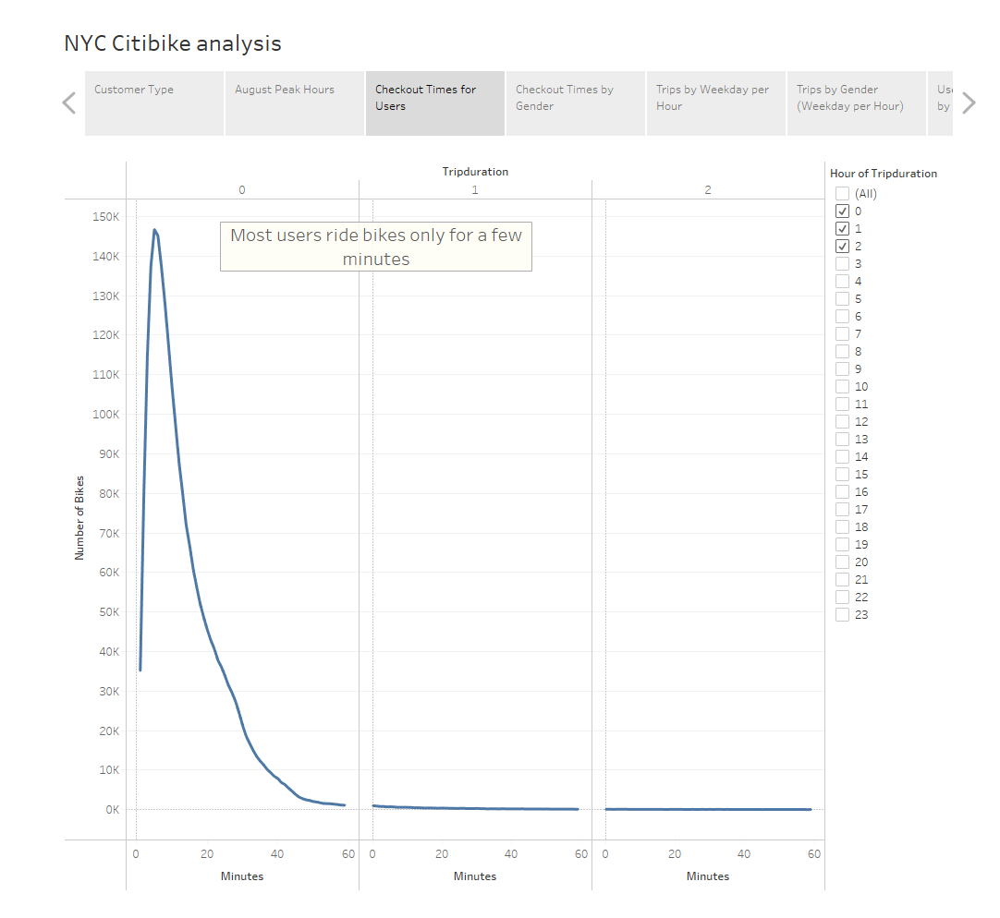

# NYC Citibike Analysis

## <u>Purpose of NYC Citibike Analysis:</u>
### Kate would like us to help her start a bikeshare program in her hometown of Des Moines, Iowa. Getting her inspiration for New York City, she would like us to use the NYC CitiBike data to solidify her business proposal.
 

[link to dashboard](https://public.tableau.com/shared/SD6XT5PQN?:display_count=n&:origin=viz_share_link "link")

## <u> Results: Visualizations for the NYC Citibike Analysis</u>
 

## Customer Type

### To get a better understanding of our data we first need to take a look at how many number of rides there are in total. The following picture shows us that there are 2,344,224 number of rides and that about 81% of the customer base are annual subscribers. 
 

## August Peak Hours

### The graph below explains why there are such high number of subscribers vs regular customers. As can be seen below, users who tend to subscribe seem to be mostly commuters.
 

## Checkout Times for Users

### The graph below shows us the length of time that bikes are checked out for all users. As can be seen, most users only make use of the service within the first hour.
 

## Checkout Times by Gender

### This graph gives us a better understanding of the bike usage by gender. Evidently, male are more prominent than female users. During the first 15 minutes male users tend to use the service twice as long as female users. This behavior, however, evens out as the checkout time becomes longer.
 

 

## Trips by Weekday per Hour

### The graph below shows us the bike trips by weekday per hour. As can be seen, commute hours are the primary reason for bike traffic during the weekdays. However, during weekends people tend to use the service in the afternoon. If we take a closer look at the trips and filter them by gender, we get similar results to what we saw in the "Checkout Times by Gender" graph. 

## Trips by Gender (Weekday per Hour)

### The following graph shows us that male users are more likely to use the service than female users. In addition, male users seem to use the service even during later hours of the day.
.png)
 

## User Trips by Gender by Weekday

### As can be seen above, there are more male than female subscribers. And generally, more subscribers use the service as opposed to one-time customers. 

 

## Summary:

### A bike sharing program in NYC seems to attract commuters more than any other type of customers. This can be explained by the heavy rush hour traffic in NYC. This would also explain the discrepancy between user type. People that commute are more likely to become subscribers than people who use the service only once. If Kate wants to provide such services in Des Moines, she needs to figure out how far and how long it takes for people to commute to work. The analysis suggests that users in NYC live relatively close to their workplace. With that said, there are two additional visualizations that I would suggest for future analysis:
- ### Location: How busy is the area during rush hour? What is the demographic of the area? How likely are people to use bikes vs cars? Where are the commuter hot spots in Des Moines?
- ### Infrastructure: How did the city plan for bike routes? Are roads easy to access and safe to use?  What is the ratio of bike vs car usage?

### Before Kate decides to offer the same service that Citibike does in NYC, she needs to make sure that there is a need for people to want to participate in a bikeshare program. 

